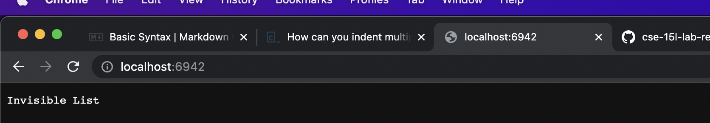
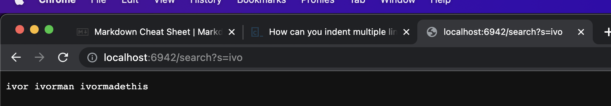
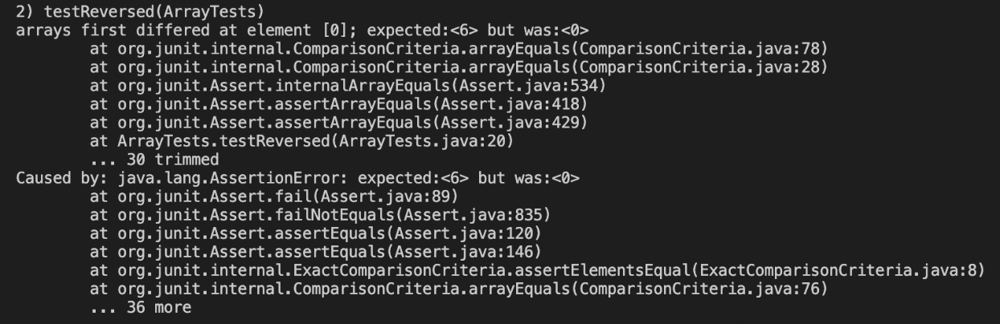
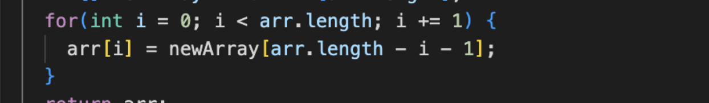
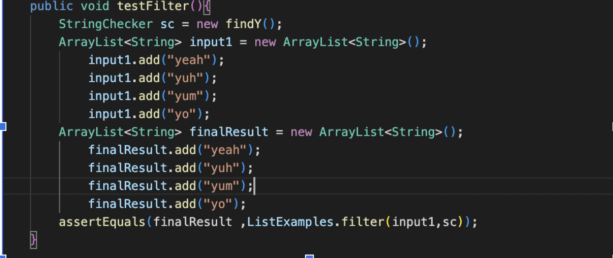
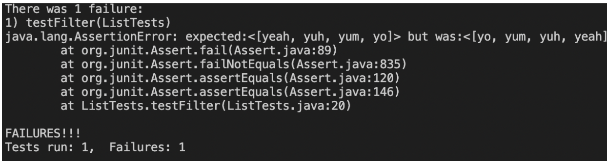

# The Second Lab Report

## Part 1: Simple Search Engine
    import java.io.IOException;
    import java.net.URI;
    import java.util.ArrayList;

    class Handler implements URLHandler {
        // The one bit of state on the server: a number that will be manipulated by
        // various requests.
        ArrayList<String> storage = new ArrayList<String>();
        int counter=0;
        public String handleRequest(URI url) {
            if (url.getPath().equals("/")) {
                return String.format("Invisible List");
            } else if (url.getPath().equals("/add")) {
                String[] parts = url.getQuery().split("=");
                storage.add(parts[1]);
                counter++;
                return String.format("String added!"+" Counter: "+Integer.toString(counter));
            } else {
                System.out.println("Path: " + url.getPath());
                if (url.getPath().contains("/search")) {
                    String[] parameters = url.getQuery().split("=");
                    String willReturn ="";
                    for(int i=0;i<storage.size();i++){ 
                        if (storage.get(i).contains(parameters[1])){ 
                            willReturn += storage.get(i)+" ";
                        }
                    }
                    return willReturn;
                }
                return "404 Not Found!";
            }
        }
    }

    class SearchEngine {
        public static void main(String[] args) throws IOException {
            if(args.length == 0){
                System.out.println("Missing port number! Try any number between 1024 to 49151");
                return;
            }

            int port = Integer.parseInt(args[0]);

            Server.start(port, new Handler());
        }
    }

Which methods in your code are called
What the values of the relevant arguments to those methods are, and the values of any relevant fields of the class
If those values change, how they change by the time the request is done processing

This is the first thing you see when opening the host. It resulted from the calling of the SearchEngine main method and starts a port. Then the hnadleReqest in the Handler class method is called and prints "Invisible List" since the only thing to grab in the url.

This first photo calls the handleRequest method, and then runs the commands for if there is "/add" in the url. That calls for adding what follows the = to a String ArrayList to store the word and adds to the counter (which is the first element added so far, thus setting the counter to 1). Then the program prints that the string was added and prints the amount of words stored.

This last screenshot displays what happens when /search is in the URL. The program searches for what is after the =, in this case "ivo". An empty string is created to add the results to and then a for loop runs to check each item in storage. An if check to see if the element has "ivo" in it. In this case 3 strings do, and they are concatinated into one string that is then printed to the users.

  

## Step 2 Exposing Bugs
### First Bug: In Reversed of ArrayExamples
#### Failure Inducing Input:
    int[] input4 = {4,5,6};
    assertArrayEquals(new int[]{6,5,4}, ArrayExamples.reversed(input1));

#### The Symptom

#### The Bug

#### Relating Them Together
The bug cuases the output to be 0 at this index (and all indexes) since the arr[i] --which is what is returned -- is being set to the newArray[arr.length -i-1] which is actually an empty list that was initialized at the beginning. 

 

### Second Bug: In Filter of ListExamples
#### Failure Inducing Input:

#### The Symptom

#### The Bug
    result.add(0, s);

#### Relating Them Together
This bug causes the new element to be added to the first index of the new ArrayList and pushes the other elements back. This puts the elements in the reverse order than is expected. 

   

# [Link To Main Page](https://ivormyers.github.io/cse-15l-lab-report/)