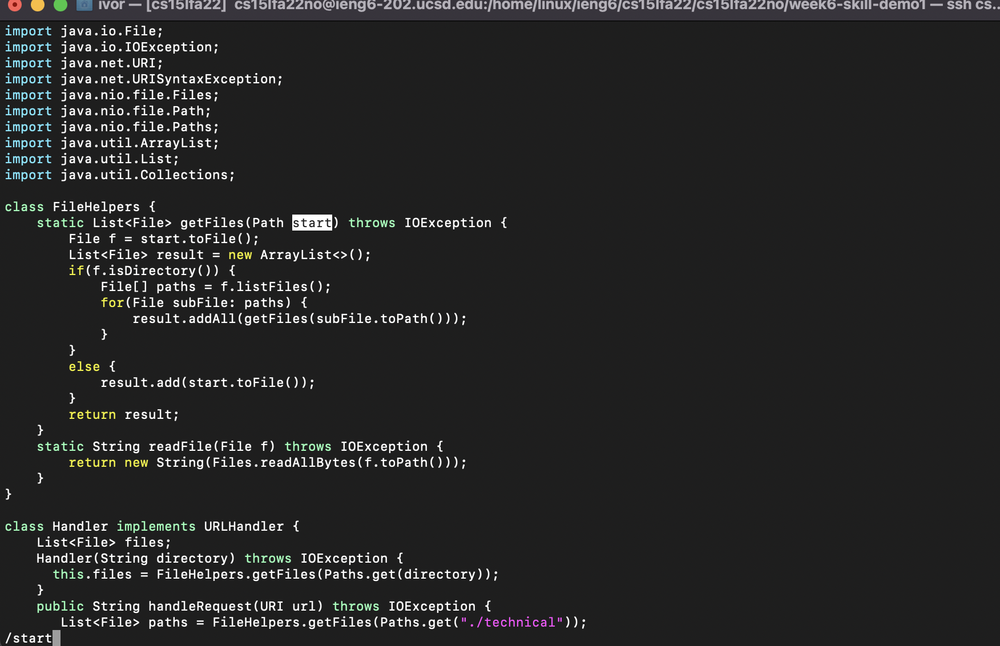
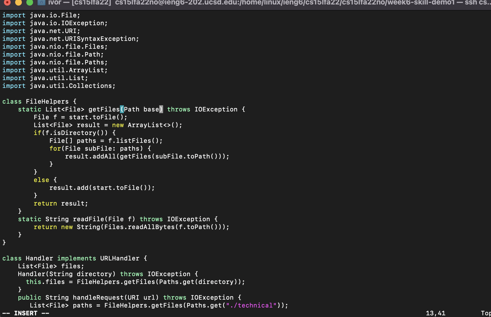
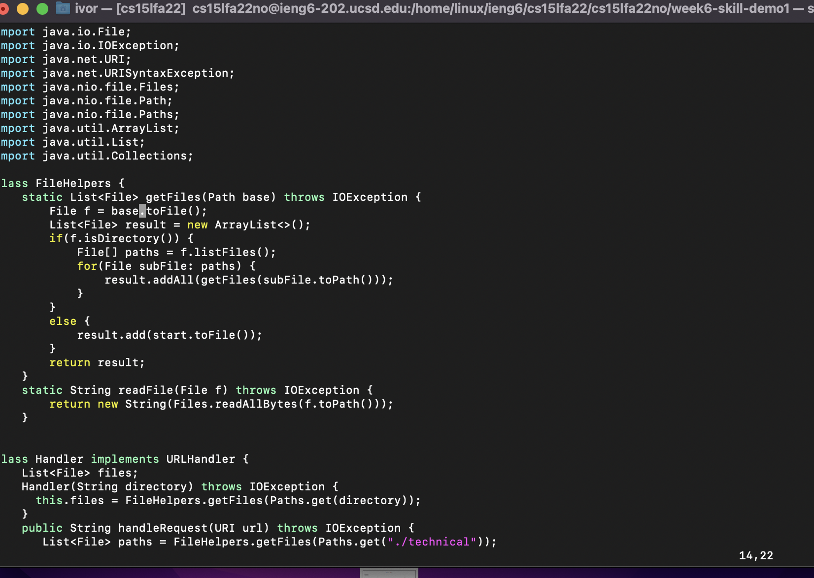
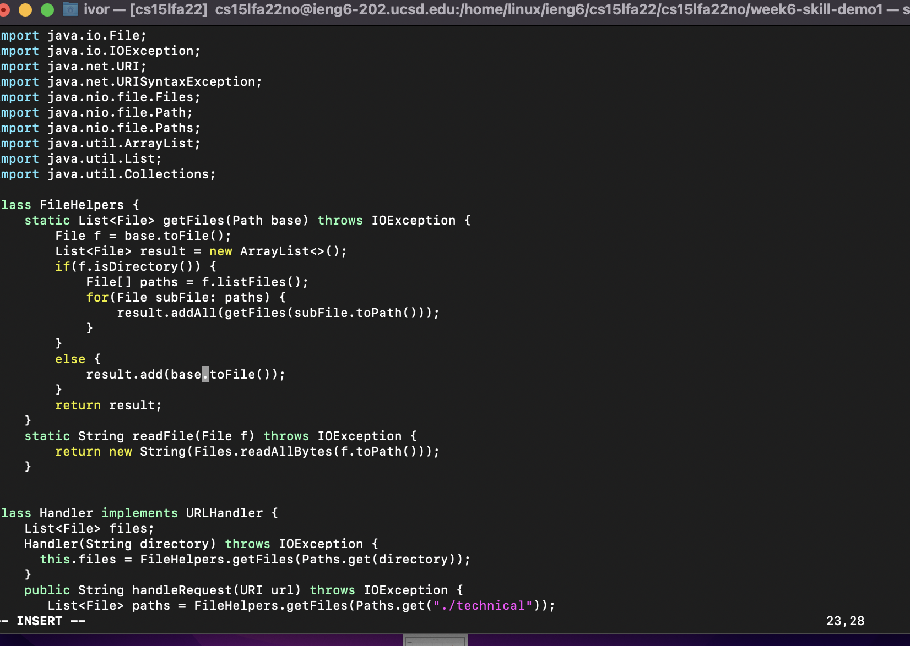

# Week 7 Lab Report: VIM

## Part 1: VIM Task

    Cd week6-skill-demo1 (enter)
    Vim DocSearchServer.java (enter)
    /start<Enter>vedibase<escape>n.lvedn.ibase<escape>

  

 
This first step uses /start and <enter> to lock onto the first insance of the word 'start'.

  

 
Here the storkes vedibase were types, to enter visual mode, select the word start, delete it, then enter insert mode and type out base. 'Escape' is then pressed to exit the editor mode.
  

 
This next step involves pressing "n.lved" which finds the next case of "start", inserts the last thing I wrote, then moves over one character (the s in start) selects the word and deletes it.
   

 
"n.ibase" Moves us to the next start, deletes it using . and then we enter insert mode and add in "base".
 

At this point the "start"s in the file have been changed to "base", so we can save and exit using :w<Enter>

## Part 2: Comparing The Times
  

### Performing the actions in VS Code: 105 Seconds
I feel this performace was a bit slower becuase my scp address was not incredibly accessible. 
  

### Performing the actions in VS Code: 69 Seconds
I feel this performace was much easier becuase I have practiced it a couple times. I could totally see myself easily messing up some of the vim commands in a scenario where I haven't already done the changes, making the whole process take much longer.    

  

### Which of these two styles would you prefer using if you had to work on a program that you were running remotely, and why?

I think if i get consistent using vim then I would much prefer to use it, as I wouldn't constantly have to reupload files onto the server. 

### What about the project or task might factor into your decision one way or another? (If nothing would affect your decision, say so and why!)

Honestly I am not really sure what about a project would factor my decision since I haven't used enough vim yet. My guess is to edit files already on the server I'll use vim, but creating new files from scratch I think VS would be better. 

 

### [Link To Main Page](https://ivormyers.github.io/cse-15l-lab-report/)