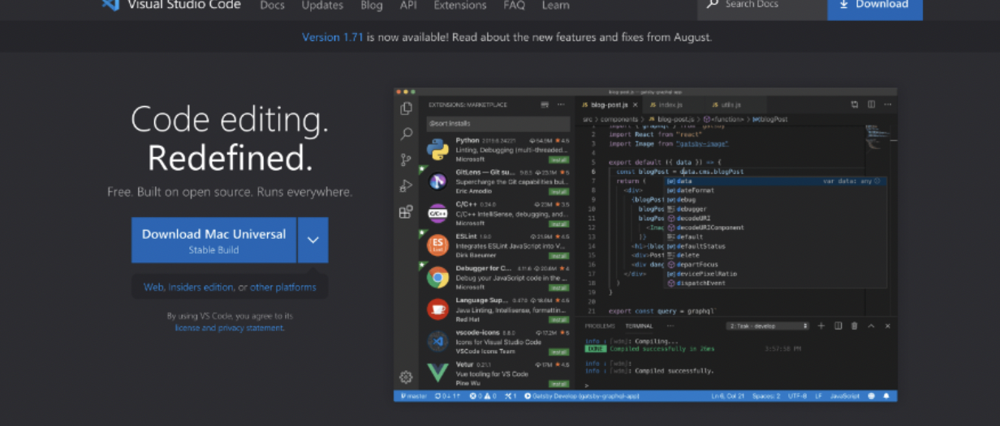
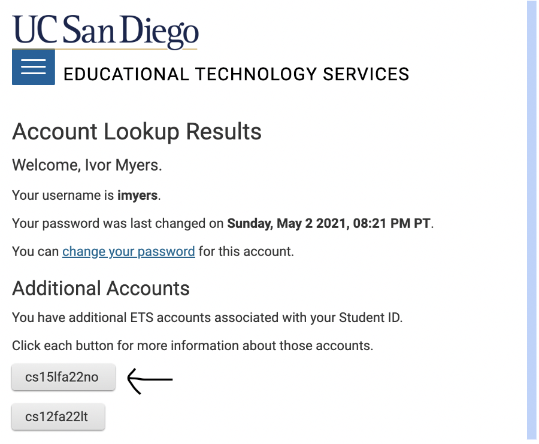
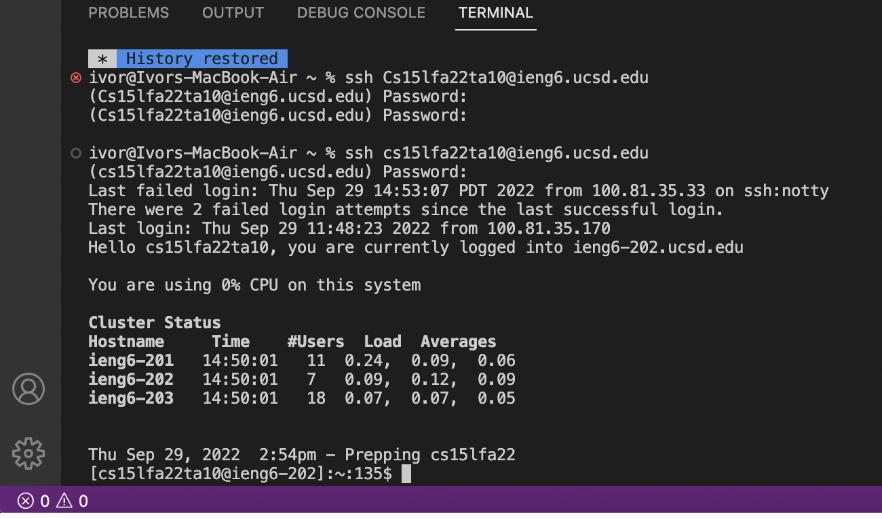
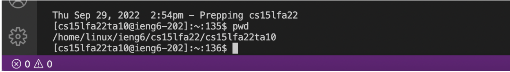
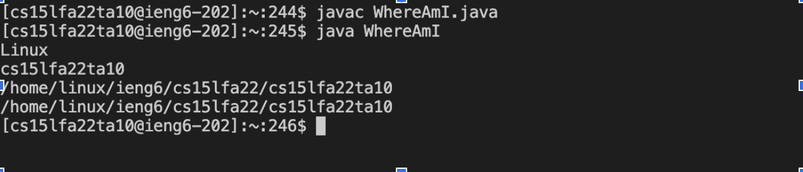
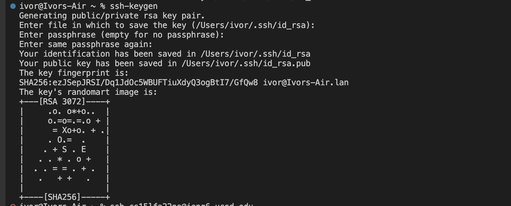

# CSE 15L Lab Report 1
## Tutorial For Incoming 15L Students
  
### Step One: Installing VS Code

Installing VScode is quite simple if you are on Mac, as you solely need to install java and VScode which can be done on their respective sites. You just need to be sure to select the proper Mac option.

### Step 2: Find Your Login For The Remote Server

To login onto [this site](https://sdacs.ucsd.edu/~icc/index.php) in order to find your specific CSE 15L user code.

   
### Step 3: Login Into The Server
After setting a passcode (if need be), use the ssh command along with the following statement to begin you access to the server: cs15lfa22(your two unique letters)@ieng6.ucsd.edu. Then you have to type in your password and that will get you into the server. 

        ssh cs15lfa22zz@ieng6.ucsd.edu
        Password: 

After logging in you will see a similar screen relaying information about your login.

   

### Step 4: Try Out Some Commands!
Go ahead and look up a couple simple commands to run on the server and have some fun seeing what they do and what you can learn about the server. 

   

### Step 5: Move Files With SCP
Moving files over is not a difficult task either! The main component here is to use the scp commands followed by the files name and destination of the files (what server it is on). It is important to be in the proper directory of where the file is and not be logged in on the server if you are transporting files to the server.

   

### Step 6: Setting An SSH Key
You paste a specific command ssh command with passwords and then save the file on your computer and in the server properly. Doing so will allow for easy access, without a password. When creating the key you should see a message similiar to this one in the image below:

After creating the keys you login into the server and move one of the keys there wtih scp and are good to go!

   

### Step 7: Optimize Remote Running
Finally for Optimizing Remote Running and moving files over, I have a hot take on it. I theoretically could do it in two strokes, but i don't think that would count because the first stoke is dependent on the last action performed being me writing out the entire calling of this process. So do as you please and experiment for what works best for you I guess!

# [Link To Main Page](https://ivormyers.github.io/cse-15l-lab-report/)
